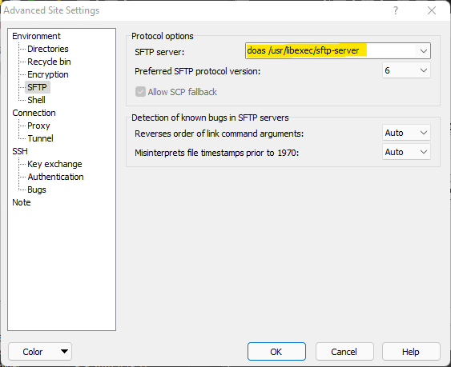

# TwinCAT-BSD-VM-creator
the script creates VirtualBox Virtual Machine from Twincat BSD image provided by [Beckhoff Automation](https://www.beckhoff.com/en-en/products/ipc/software-and-tools/operating-systems/c9900-s60x-cxxxxx-0185.html). You can find lots of useful information in the [documentation](https://download.beckhoff.com/download/Document/ipc/embedded-pc/embedded-pc-cx/TwinCAT_BSD_en.pdf).

## Using the batch file

Download TwinCAT BSD image from Beckhoff automation website;
Extract the zip file in the same directory where the script is located.
the image file will be xxxx.iso
open the script and modify the line 3 the "TCBSD-x64-12-40411.iso" to match your image name

SET sourcefilename="new image name.iso"

## Using PowerShell script

Run `Create-TcBsdVM.ps1` where the first parameter is the virtual machine name and the second is the TCBSD image file that you will need to download and unzip the working folder.

The script will also verify the `VirtualBox` installation at the location `Program Files\Oracle\VirtualBox` on the same drive where the working folder is located. If you have the VirtualBox installed in some other location, provide the path to that folder at the third positional parameter of the script.

The virtual machine folder will be created in the working folder.

Usage

~~~PowerShell
PS C:\YOUR_FOLDER\.\Create-TcBsdVM.ps1 MyLovelyTcBSD TCBSD-x64-12-40411.iso
~~~

## Using the bash script

The included bash script ``create_tc_bsd_vm.sh`` will generate a VM with the
following specifications:

* 8GB OS primary OS (SATA) disk image
* 1GB of RAM
* One network adapter (NAT -> may require reconfiguration; see below)
* The bootable TwinCAT BSD installation media connected as the second SATA drive
    * This will boot until the installation is complete. It can be removed
      after installation is done, but it will not interfere with TC/BSD
      from booting post-installation even if it remains.

In order to use it, you must:

* Download TwinCAT BSD image from Beckhoff first. Place it in the same
  directory as the script.
* Run ``./create_tc_bsd_vm.sh your_plc_name_here [/path/to/tcbsd.iso]``

Notes:

* If you only have a single TCBSD ISO in the same directory, the script will
  find it and use it automatically. In that case, you will only need to specify
  the PLC name.
* VBoxManage is expected to be on the ``PATH`` prior to running the script.
* After creating a VM, a file browser will be opened to the path where the
  generated image is.
* The script will register the VM with VirtualBox.  If a VM already is
  registered with the same name, it will give you the option of unregistering
  the old one.

# Setting up the network interface

If VMs network defaults to `NAT`, you may not be able to connect to the PLC. Therefore you should set the virtual network either to `Host-Only Adapter` if you are working with the PLC only from the host computer; or `Bridged Adpater` to set up a physical connection to the outside network.

# Solving route creation issue

If you are having issues creating route to your VM, the reason could be that you are trying to create unsecured ADS connection. Unencrypted ADS connections are dissabled by default. To fix this issue, either use an encrypted route or update the rules in your VM's firewall. To do this, connect to your VM through WinSCP.

 

To start WinSCP with root rights, edit connection settings and click on Advanced. Update entry for SFTP server with entry `doas /usr/libexec/sftp-server` and click OK and SAVE. 
 
 

Finally to update firewall rules, navigate to file `/etc/pf.conf` and add entry `pass in quick proto tcp to port 48898 synproxy state`. Save file and reboot your VM.

